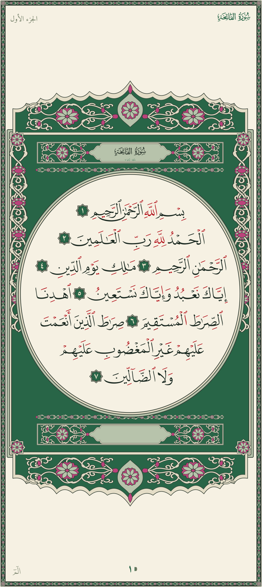

# Quran SVG — QCF v4

A complete 604-page Madani Mushaf as self-contained, responsive SVG files.
The Qur'anic letterforms come from the QCF v4 colour edition and include
addressable tajweed layers, ayahs and words for reader applications.

> **Edition scope:** this repository publishes only QCF v4. The public page
> corpus is [`mushaf-v4/`](mushaf-v4/); older local experiments are excluded
> from Git and are not part of the project API.

<p align="center">
  
</p>

## What is included

| Property | Value |
| --- | --- |
| Pages | 604, named `page-001.svg` through `page-604.svg` |
| Edition | QCF v4, Hafs, with optional tajweed colouring |
| Canvas | `viewBox="0 0 1000 2231"` |
| Runtime fonts | None; every visible glyph is an SVG outline |
| Default theme | `green-pink` |
| Other themes | `blue`, `night`, `olive-gold`, `sepia` |
| Interactions | Ayah highlight, word highlight, word selection, layer toggles |
| Integrity metadata | [`manifest.json`](manifest.json), with a SHA-256 for every page |

Each page is portable: it has its own styles, paths, accessibility title and
description, page metadata, and interaction hooks. No font file or JavaScript
is needed to display it.

## Use a page

Copy the SVG files you need into your project, or vendor the whole
`mushaf-v4/` directory. Page numbers are always zero-padded to three digits.

```html

```

An `` is enough for display. To change themes, highlight recitation, or
handle word taps, load the SVG inline so your code can reach its elements:

```js
const page = 248;
const file = `mushaf-v4/page-${String(page).padStart(3, "0")}.svg`;
const markup = await fetch(file).then((response) => response.text());

document.querySelector("#reader").innerHTML = markup;
const svg = document.querySelector("#reader > svg");

svg.querySelector("#q-a12-106")?.classList.add("is-active");
svg.querySelector("#q-w12-106-3")?.classList.add("is-active");
svg.classList.add("q-tajweed");
```

Open the dependency-free [interactive viewer](examples/viewer.html) to inspect
pages, switch themes, toggle tajweed and click words:

```bash
python -m http.server 8000
# Visit http://localhost:8000/examples/viewer.html
```

The [integration guide](docs/INTEGRATION.md) documents the stable IDs,
metadata, theme replacement protocol, layer toggles, and renderer guidance.

## Stable SVG contract

```xml
<svg data-page="248" data-edition="qcf-v4" data-theme="green-pink"
     data-text-box="x y width height">
  <g id="q-ground">...</g>
  <g id="q-frame">...</g>
  <g id="q-page">
    <g id="q-chrome">...</g>
    <g id="q-openings">...</g>
    <g id="q-text">
      <g class="q-ayah" id="q-a12-106" data-ayah="12:106">
        <g class="q-word" id="q-w12-106-3"
           data-loc="12:106:3" data-line="4"
           data-box="x y width height">...</g>
      </g>
    </g>
  </g>
</svg>
```

The main controls are:

| Intent | Operation |
| --- | --- |
| Highlight an ayah | Add `is-active` to `#q-a{surah}-{ayah}` |
| Highlight a word | Add `is-active` to `#q-w{surah}-{ayah}-{word}` |
| Mark a selection | Add `is-selected` to a `.q-word` group |
| Enable tajweed | Add `q-tajweed` to the root `<svg>` |
| Show only rule colours | Add `q-tajweed q-tajweed-plain` to the root |
| Remove the frame | Add `q-no-frame` to the root |
| Remove running chrome | Add `q-no-chrome` to the root |

`data-box` values use viewBox coordinates and can be used to build touch
targets. Word IDs use `surah:ayah:word` data locations with colons changed to
hyphens. The machine-readable theme contract is
[`themes-v4/schema.json`](themes-v4/schema.json).

## Validate the published corpus

The release check parses every page, verifies the public contract and theme
files, and compares every byte against the manifest:

```bash
python tools/validate_release.py
```

This check has no third-party dependencies. GitHub Actions runs it for every
pull request and push.

## Rebuild pages

The checked-in SVGs are ready to use. Rebuilding is intended for maintainers
and contributors and requires Python 3.10 or newer:

```bash
python -m pip install -r requirements.txt
python tools/quransvg.py fetch 248
python tools/quransvg.py build 248 --out build
python tools/quransvg.py verify 1,2,248,604
```

Page selectors accept lists and ranges, so `1,2,10-20` and `1-604` are valid.
Downloaded fonts and source data stay under `data/` and are intentionally not
committed. After changing published pages, regenerate and check the manifest:

```bash
python tools/build_manifest.py
python tools/validate_release.py
```

The v4 builder shares page-furniture code in `src/qsvg/`; that package name is
an internal implementation detail. `src/qsvg4/`, `themes-v4/`, and
`mushaf-v4/` define the supported edition and public output.

## Accuracy and issue reports

Qur'anic text deserves a higher review standard than ordinary artwork. The
generator checks page numbering, addressable word metadata, layer structure,
theme coverage, line fit and deterministic output. Automated checks cannot
replace scholarly review.

If you find a possible rendering or text issue, please open a
[Qur'an data or rendering report](https://github.com/NextTokens/quransvg/issues/new?template=quran-data.yml)
and include the page, surah, ayah, word when applicable, renderer, and a clear
screenshot. Do not submit hand-edited generated SVGs.

## Sources, rights and attribution

The page letterforms are derived from the QCF v4 Tajweed fonts attributed to
the King Fahd Glorious Qur'an Printing Complex and Dar Al Maarifah. Font and
word-layout inputs are fetched from their documented delivery sources and are
not committed. Surah-name resources come from the Quranic Universal Library;
page metadata is obtained from the Quran Foundation API; Amiri is licensed
under the SIL Open Font License.

The MIT license covers the original software in this repository. It does not
relicense Qur'anic text, QCF-derived glyph outlines, upstream fonts, or other
third-party material. Read [NOTICE.md](NOTICE.md) before redistributing the SVG
corpus or embedding it in a product. This project is independent and is not
endorsed by the upstream providers.

Contributions are welcome. Start with [CONTRIBUTING.md](CONTRIBUTING.md), which
explains the review expectations for code, themes and Qur'anic rendering.
